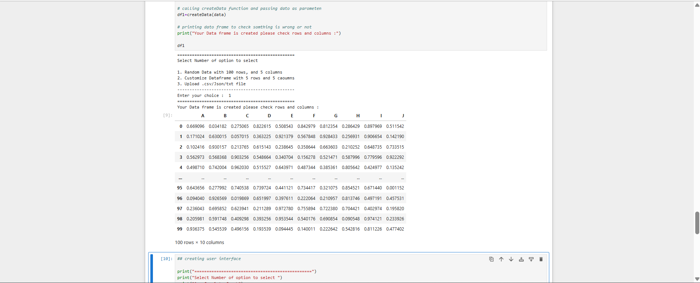
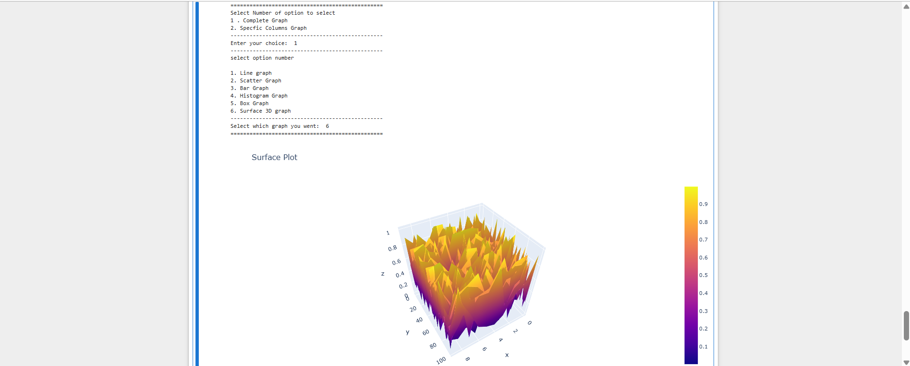
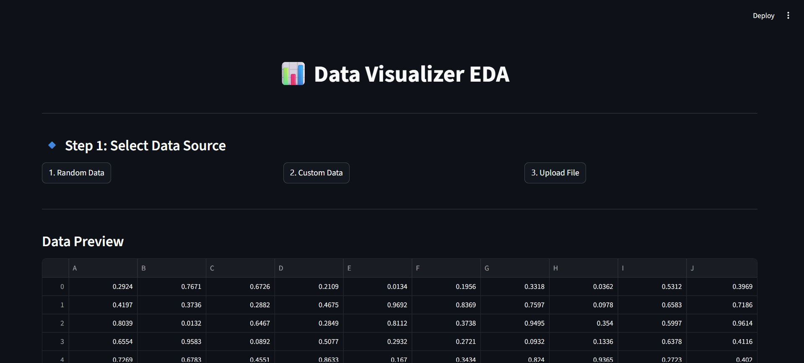
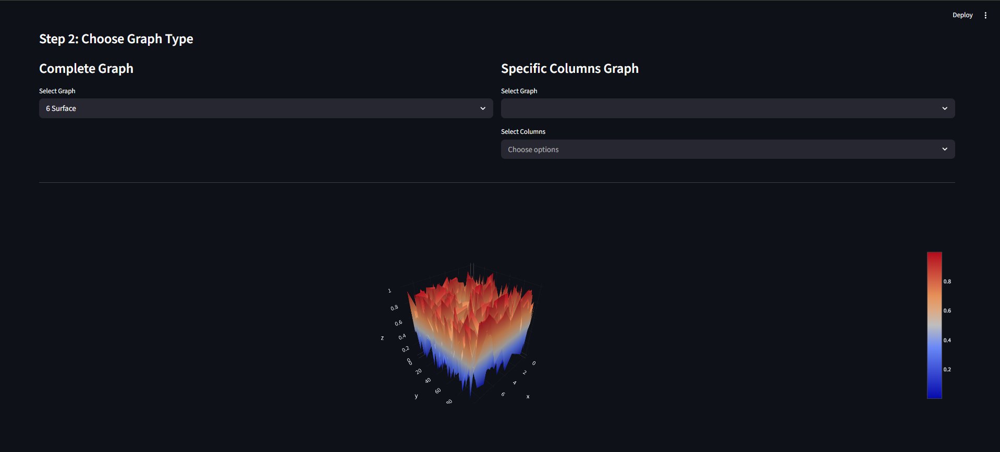

# 📊 Data Visualizer

A simple and interactive project to **visualize data using different graph types**.  
This tool allows users to explore data in multiple ways using both:

- 🖥️ Command Line Interface (CLI)
- 🌐 Streamlit Graphical User Interface (GUI)

---

## 🎯 Aim

The main objective of this project is to provide an easy way to:

- Visualize **CSV file data**
- Generate and explore **random datasets**
- Create and analyze **custom 5×5 datasets**
- Experiment with different **graph types**
- Offer both **CLI-based** and **GUI-based** interaction

---

## ✨ Features

- 📁 Upload and visualize CSV data  
- 🎲 Generate random datasets for quick analysis  
- 🧮 Create custom datasets (5 rows × 5 columns)  
- 📊 Multiple visualization options:
  - Line Graph  
  - Scatter Plot  
  - Bar Chart  
  - Histogram  
  - Box Plot  
  - 3D Surface Plot  
  - Bubble Chart  

- 🔍 Flexible visualization:
  - Complete dataset view  
  - Specific column-based graphs  

- 💻 Dual Interface:
  - CLI (fast and lightweight)
  - Streamlit GUI (interactive and user-friendly)

---

## 🛠️ Tech Stack

- Python  
- Pandas  
- NumPy  
- Plotly  
- Streamlit  

---


## 📸 Screenshots

### 🖥️ CLI Interface

| CLI Output 1 | CLI Output 2 |
|-------------|-------------|
|  |  |

---

### 🌐 GUI Interface (Streamlit)

| GUI Screen 1 | GUI Screen 2 |
|--------------|--------------|
|  |  |


---

## 💡 Use Cases

- Data Exploration  
- Learning Data Visualization  
- Academic Projects  
- Quick Graph Generation  

---

## 📌 Future Enhancements

- Add more graph types (Heatmap, Pie Chart)  
- Support for Excel files  
- Dashboard-style UI  
- Advanced filtering options  
- AI-based insights  

---


### 🔹 Main Libraries Used

- pandas  
- numpy  
- plotly  
- streamlit  
- cufflinks  

---

## ⚙️ Optional (Manual Install)

If you prefer installing manually:

```bash
pip install pandas numpy plotly streamlit cufflinks
```

---

## 👨‍💻 Author

Tejas Dhangar

